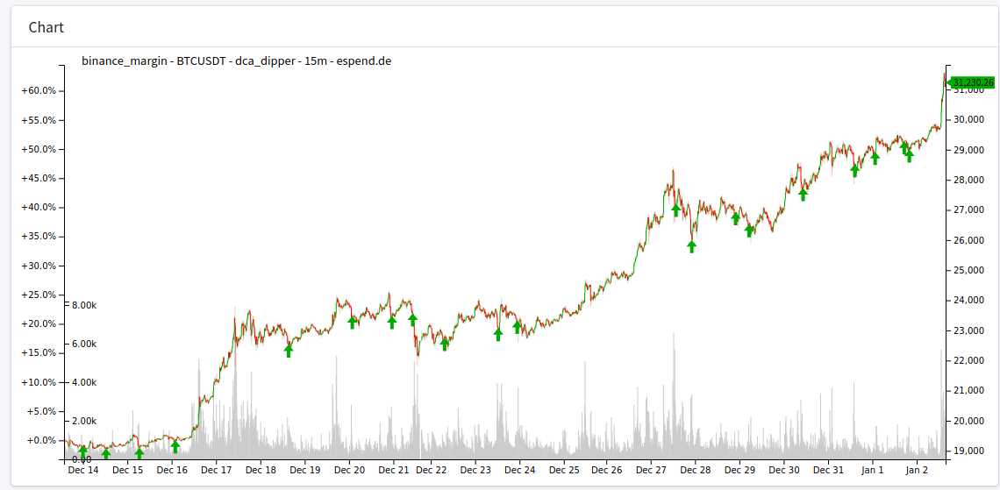
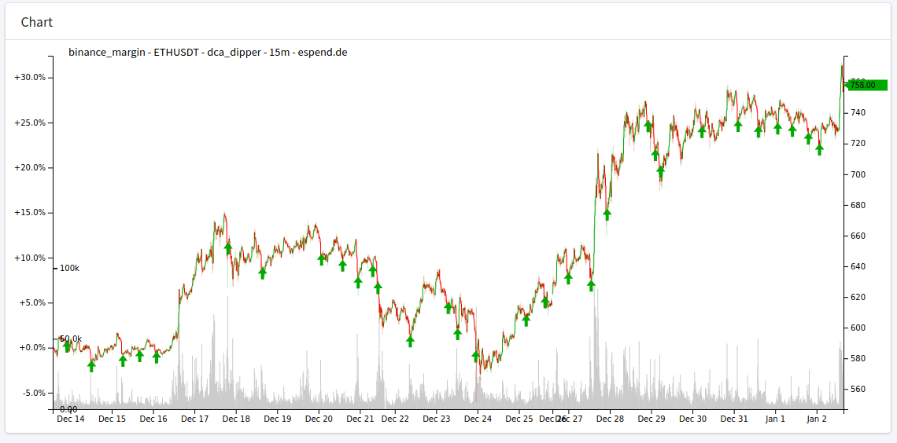

# Dollar-Cost Averaging (DCA) - Dip Investing Strategy

Try to invest only on a dip with a fixed amount

Long term strategy only **not sell singals** ;)

## TODO

* provide capital invested control: daily, weekly limits, ... 

## Entry (Buy)

Using Bollinger Band and only invest when crossing lower band with a HMA line.

## Configuration

As most exchanges have a minimum order amount of >10 USD you must reduce the signals.

Default configuration is providing around a signal every 2 days. Which will be a monthly invest of 140 USD.

 * `amount_currency` just buying 12 USD (BTCUSD) for every signal given.
 * `percent_below_price` placing the order "0.1%" below the price.   

```json
{
  "period": "15m",
  "amount_currency": "12",
  "percent_below_price": 0.1,
  "hma_period": 9,
  "hma_source": "close"
}
```

`hma_period` and `hma_source` can be used to generate more signals.

```json
{
  "period": "15m",
  "amount_currency": "12",
  "percent_below_price": 0.1,
  "hma_period": 12,
  "hma_source": "low"
}
```

## Backtest





