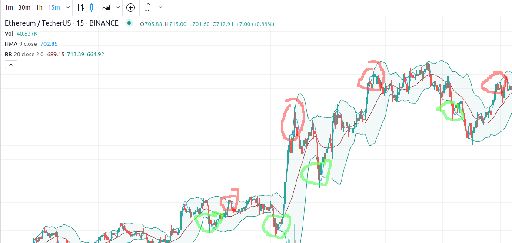
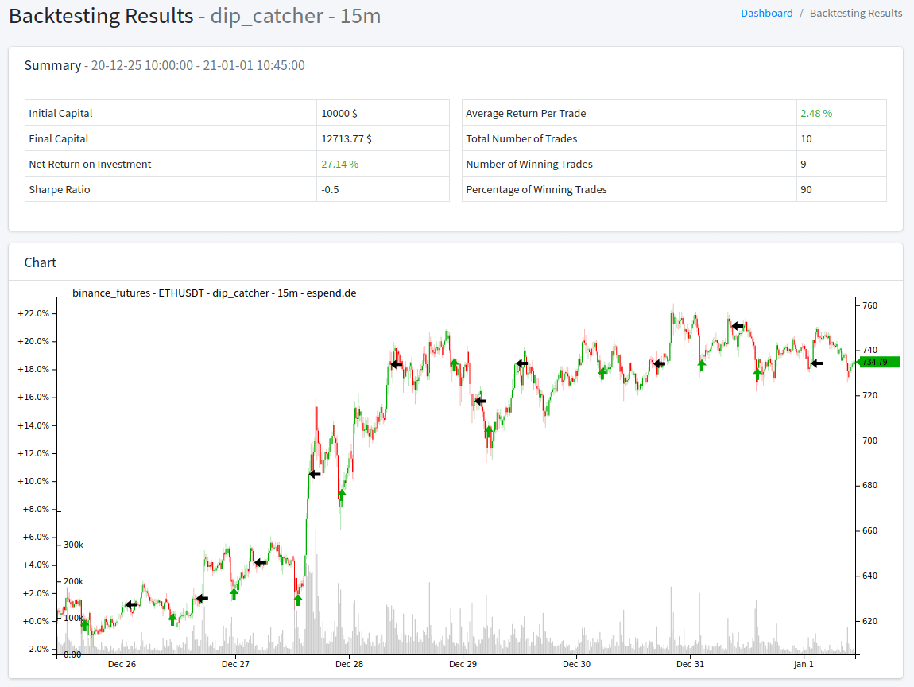

# Dip / Retracement Catcher

Try to catch a dip or retracement on the higher trend

## Trend Indicator

Ichimoku Cloud "Lead2 Line" given the "long" or "short" trend based on higher timeframe (4x multipler of main period)

## Entry / Exit

HMA (source: candle low) is cross from lower Bollinger for vice versa for opposite signal

## Configuration

Default config is more secure given less signals.

```json
{
  "period": "15m",
  "trend_cloud_multiplier": 4,
  "hma_high_period": 9,
  "hma_high_candle_source": "close",
  "hma_low_period": 9,
  "hma_low_candle_source": "close"
}
```

More signals can be generate by change the candle source and higher the signal line 

```json
{
  "period": "15m",
  "trend_cloud_multiplier": 4,
  "hma_high_period": 12,
  "hma_high_candle_source": "high",
  "hma_low_period": 12,
  "hma_low_candle_source": "low"
}
```

## Tradingview



## Backtest



